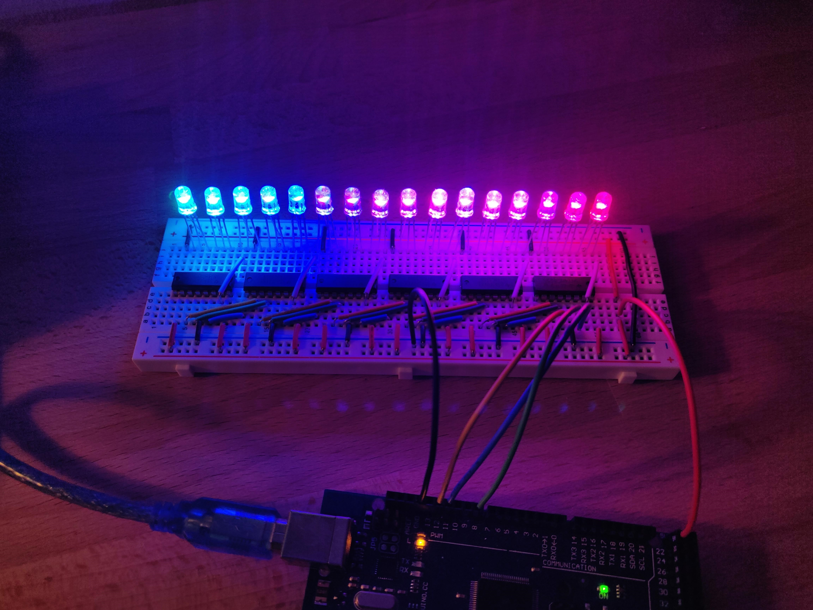
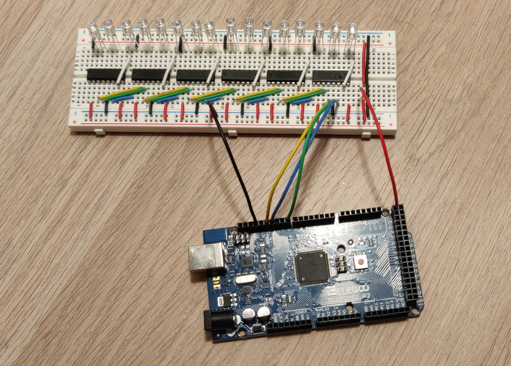

# Controlling RGBs LEDs with an Arduino and Shift Registers

## May 17th 2019
* Second attempt at PWM
* Debugging to this point was a pain in the neck
* It was so satisfying when it finally worked

## May 17th 2019
* First attempt at PWM
* That's not quite right...

## May 15th 2019
* Project Added to GitHub
* Able to control RGB LEDs through multiple shift registers
* Shift Registers output HIGH or LOW
* Limited to 8 possible colors/states for each LED
  * Teal
  * Pink
  * Yellow
  * Blue
  * Green
  * Red
  * White
  * Off
* The shift registers I have don't natively support pulse wave modulation (PMW)
* I plan to add PMW to open up the full RGB colors space

### Current Setup

May 15th

### Function

April 16th
